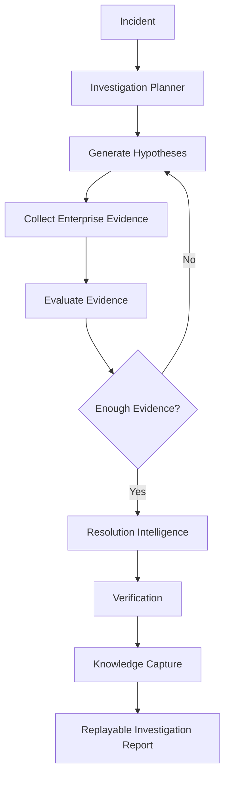
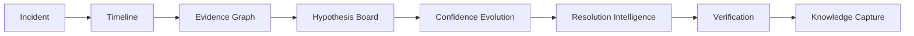
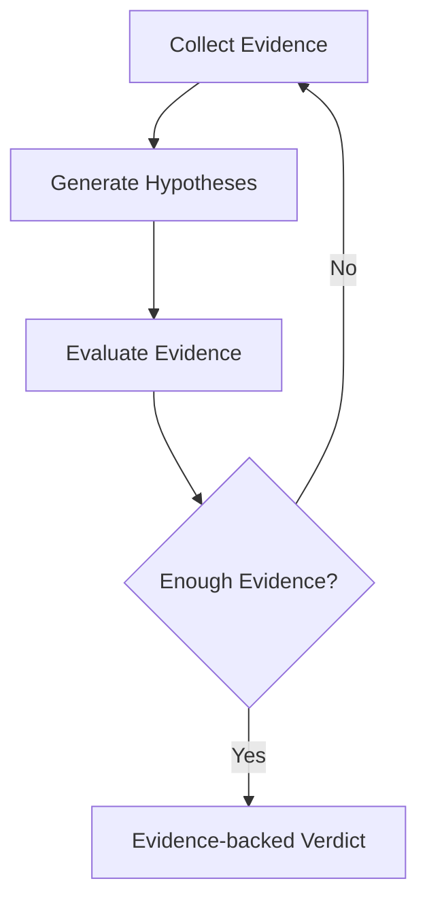
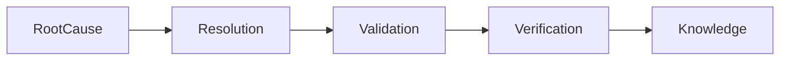
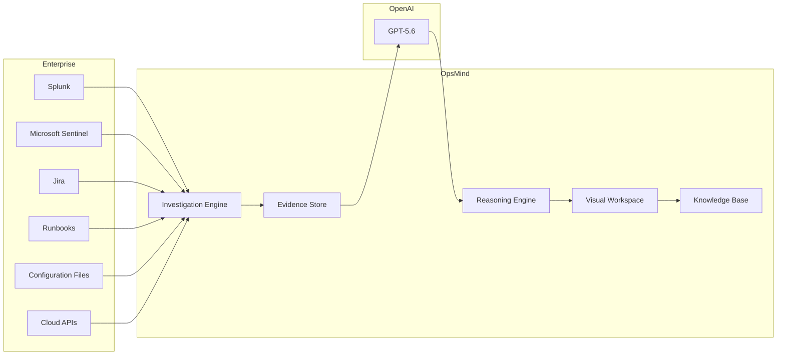
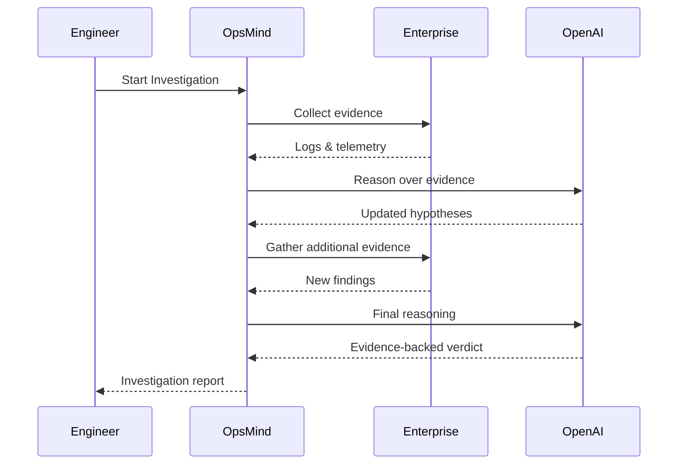

# OpsMind

<p align="center">

### **AI-Powered Investigation Platform**

## **LLMs answer from what they know.**

# **OpsMind investigates what your enterprise knows.**


<br/>


</p>

---

## 🎬 Golden Demo

<p align="center">

</p>

| Capability | Demo |
|------------|------|
| ⚡ Investigation | Multi-round AI reasoning |
| 🔍 Evidence | Enterprise evidence collection |
| 📈 Confidence | Confidence evolves each round |
| 📖 Replay | Replayable investigations |
| 🧠 Knowledge | Automatic knowledge capture |
| 🤖 AI | OpenAI GPT-5.6 reasoning |

> **Demo metrics represent the bundled Golden Demo and are intended to demonstrate capabilities—not production benchmarks.**

---

## Production incidents don't fail because engineers can't solve problems.

### They fail because engineers spend too much time finding the problem.

OpsMind is an **AI Investigation Platform** built for operational engineering teams.

Instead of producing an immediate answer, OpsMind investigates your enterprise, gathers evidence, evaluates competing hypotheses, and reaches an explainable conclusion.

It combines deterministic engineering with OpenAI reasoning to make investigations transparent, repeatable, and evidence-backed.

---

## The Problem

A modern production investigation often looks like this:

```text
Incident
   │
   ├── Splunk
   ├── Microsoft Sentinel
   ├── Jira
   ├── Confluence
   ├── Configuration Files
   ├── SSH Sessions
   ├── Dashboards
   └── Historical Incidents

        ↓

Hours spent collecting context before solving the issue
```

The investigation—not the remediation—is usually the slowest phase.

---

## Why Not Just Use ChatGPT?

| General AI | OpsMind |
|------------|----------|
| Answers questions | Investigates systems |
| Uses pretrained knowledge | Collects enterprise evidence |
| One response | Multi-round investigation |
| No investigation history | Replayable investigations |
| Cannot reject hypotheses | Rejects weak hypotheses with evidence |

General-purpose LLMs answer from what they already know.

Production incidents are different.

The answer usually exists inside **your enterprise**, not inside the model.

---

## How OpsMind Thinks

Instead of immediately responding, OpsMind:

1. Plans an investigation
2. Generates competing hypotheses
3. Collects enterprise evidence
4. Correlates telemetry
5. Rejects unsupported hypotheses
6. Updates confidence after every reasoning round
7. Produces an evidence-backed verdict
8. Generates remediation guidance
9. Verifies recovery
10. Captures reusable operational knowledge

> ### AI never invents evidence.
>
> Every conclusion must be supported by evidence collected from enterprise systems.

---

## Investigation Lifecycle



---

## Example Investigation

```text
INC-2026-0719-001

Heavy Forwarder stopped forwarding logs
```

Possible causes:

- Expired certificate
- Firewall block
- outputs.conf misconfiguration
- Disk full
- Blocked forwarding queues
- Authentication failure

The engineer never selects the root cause.

**OpsMind discovers it through investigation.**

---

## Investigation Engine

Every reasoning round:

- Collects new evidence
- Refines hypotheses
- Rejects weak explanations
- Updates confidence
- Preserves a complete reasoning trace

The investigation continues until sufficient trustworthy evidence exists to defend the final conclusion.

---

## Product Vision

Engineers don't need another chatbot.

They need an investigation partner that understands enterprise systems, reasons over evidence, explains every decision, and makes every future investigation faster.

**OpsMind is building that future.**

## 🖥️ Visual Investigation Workspace

OpsMind is built around a **visual investigation workspace**, not a chat window.

Every investigation becomes a living workspace where evidence, hypotheses, confidence, and decisions evolve together.

---

## Workspace Overview



---

## Workspace Components

| Component | Purpose |
|-----------|---------|
| 🕒 Timeline | Shows every investigation step chronologically |
| 🕸️ Evidence Graph | Visualizes relationships between evidence |
| 🧠 Hypothesis Board | Tracks competing root-cause theories |
| 📈 Confidence Evolution | Shows confidence changing over time |
| 🛠️ Resolution Intelligence | AI-assisted remediation guidance |
| ✅ Verification Dashboard | Confirms the incident is actually resolved |

Together these views allow engineers to understand **how** OpsMind reached a conclusion—not just **what** the conclusion was.

---

# Workspace Preview

### Dashboard


---

### Investigation Workspace


---

### Evidence Graph


---

### Investigation Timeline


---

### Confidence Evolution


---

### Hypothesis Board


---

### Resolution Intelligence


---

### Verification Dashboard


---

## Multi-Round Investigation Engine

Unlike traditional assistants that stop after one answer, OpsMind reasons iteratively.



Each reasoning round can:

- Collect additional telemetry
- Refine hypotheses
- Reject weak explanations
- Increase or decrease confidence
- Record every decision for replay

---

## Resolution Intelligence

Finding the root cause is only part of the investigation.

OpsMind also produces structured remediation guidance.



Every recommendation is linked back to the evidence that justified it.

---

## Verification

OpsMind treats verification as a first-class investigation stage.

Before an incident is considered resolved it can verify:

- Service health
- Data ingestion
- Alert recovery
- Queue status
- Connectivity
- Platform health

This helps reduce false recoveries.

---

## Knowledge Capture

Every completed investigation becomes organizational knowledge.

Captured artifacts include:

- Incident summary
- Evidence collected
- Final verdict
- Resolution
- Verification results
- Lessons learned

Future investigations benefit from everything learned previously.

---

## Investigation Playback

Every investigation is replayable from start to finish.

Benefits include:

- Explainability
- Auditability
- Training
- Incident reviews
- Faster onboarding

No reasoning step is hidden.

---

## Built with OpenAI

OpsMind combines deterministic engineering with OpenAI reasoning.

| Deterministic Platform | OpenAI Reasoning |
|------------------------|------------------|
| Evidence collection | Investigation planning |
| Connector execution | Hypothesis generation |
| Configuration parsing | Evidence interpretation |
| Log & telemetry retrieval | Root cause reasoning |
| Verification | Executive summaries |

> OpenAI never invents evidence. It reasons only over enterprise evidence collected by OpsMind.

---

## High-Level Architecture



---

## Investigation Pipeline



---

## Why This Workspace Matters

Traditional tools show data.

Traditional chatbots generate answers.

**OpsMind visualizes the entire investigation.**

Engineers can inspect every hypothesis, every piece of evidence, every confidence update, and every reasoning step before accepting the final verdict.

