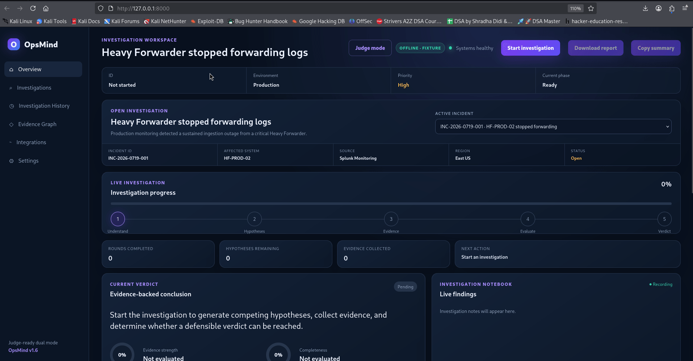
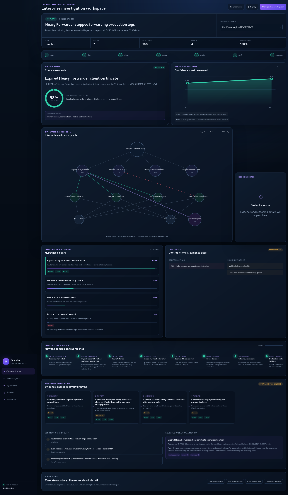
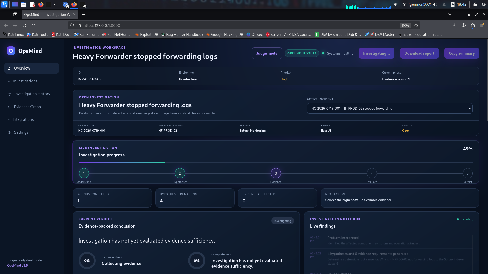
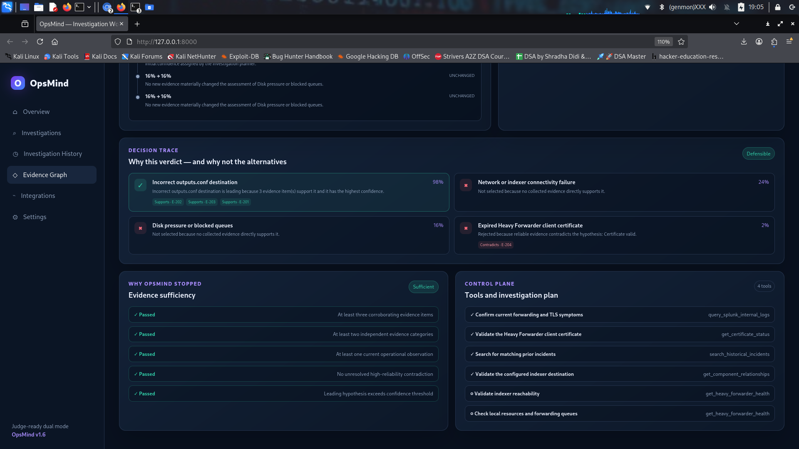
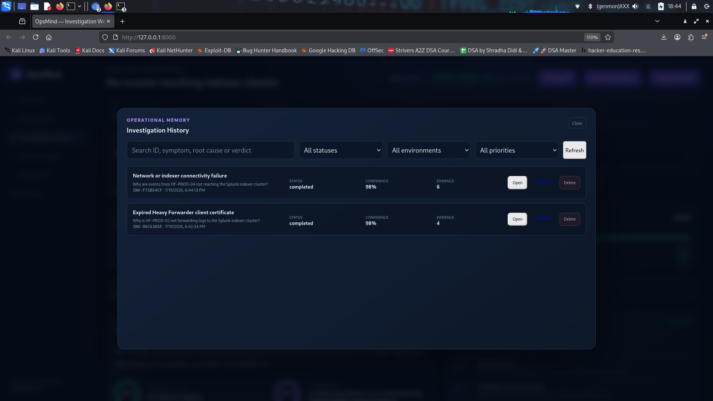

# OpsMind

# OpsMind v2.0 — Visual AI Investigation Platform

OpsMind now exposes its multi-round investigation engine through a visual enterprise workspace. Engineers can inspect an interactive evidence graph, compare competing hypotheses, see confidence evolve across rounds, replay the reasoning timeline, and follow an evidence-backed resolution and verification lifecycle.

## Visual workspace capabilities

- Interactive evidence graph with support, contradiction and enterprise-entity relationships
- Presentation-ready workspace API: `GET /api/v1/investigations/{id}/workspace`
- Confidence evolution by investigation round
- Hypothesis whiteboard with supporting and contradicting evidence
- Replayable investigation timeline
- Containment, recovery, verification, rollback and prevention flow
- Verification checklist and reusable operational memory
- Engineer and executive views
- Deterministic local judge scenario with no external API key required

See [`docs/VISUAL_INVESTIGATION_WORKSPACE.md`](docs/VISUAL_INVESTIGATION_WORKSPACE.md) and [`docs/JUDGE_GUIDE.md`](docs/JUDGE_GUIDE.md).


<p align="center">

# LLMs answer from what they know.

# **OpsMind investigates what your enterprise knows.**

### AI-Powered Incident Investigation Engine


</p>

---

## Overview

OpsMind is an AI-powered Incident Investigation Engine that helps platform engineers investigate operational incidents by collecting enterprise evidence, evaluating competing hypotheses, and producing evidence-backed conclusions.

Unlike traditional AI assistants that answer immediately, OpsMind investigates enterprise systems before reaching a conclusion.

---

## 🎥 Demo



---

# The Problem

During production incidents, engineers spend valuable time switching between multiple systems before they can even begin reasoning about the problem.

Typical investigation sources include:

- Splunk
- Microsoft Sentinel
- Configuration Files
- SSH Sessions
- Jira
- Runbooks
- Internal Documentation
- Historical Incidents

The investigation—not the remediation—is usually the slowest part.

---

# Why Not Just Use ChatGPT?

General-purpose LLMs answer from what they already know.

Production incidents are different.

The answer rarely exists inside the model.

It exists inside your enterprise.

OpsMind doesn't ask AI to guess.

OpsMind asks AI to investigate.

Instead of immediately producing an answer, OpsMind:

1. Plans an investigation
2. Generates competing hypotheses
3. Collects enterprise evidence
4. Rejects incorrect hypotheses
5. Produces an evidence-backed verdict

The result is not simply an AI response—it is an explainable investigation.

---

# What Makes OpsMind Different?

| Traditional AI | Retrieval-Augmented Generation | OpsMind |
|----------------|-------------------------------|----------|
| Answers immediately | Retrieves documents | Plans an investigation |
| Uses pretrained knowledge | Uses retrieved context | Builds enterprise evidence |
| Single response | Context-aware response | Multi-step reasoning |
| No investigation | No decision trace | Explainable investigation |
| Cannot reject hypotheses | Returns retrieved information | Rejects incorrect hypotheses |
| Limited operational memory | Limited to retrieved documents | Investigation history |

---

# What OpsMind Does

Every investigation follows the same lifecycle.

```text
Incident

↓

Investigation Planner

↓

Generate Hypotheses

↓

Collect Enterprise Evidence

↓

Evaluate Hypotheses

↓

Update Confidence

↓

Enough Evidence?

├── No → Continue Investigation
└── Yes → Produce Verdict

↓

Generate Investigation Report

↓

Store Investigation History
```

OpsMind continuously builds confidence as evidence is collected rather than immediately generating an answer.

---

# Demo Scenario

Example Incident

```
INC-2026-0719-001

Heavy Forwarder stopped forwarding logs
```

Possible hidden root causes

- Expired client certificate
- Firewall block
- outputs.conf misconfiguration
- Disk full
- Blocked forwarding queues

The engineer never selects the root cause.

OpsMind discovers it through investigation.

---

# Where AI is Used

OpsMind combines deterministic engineering with OpenAI reasoning models.

| Deterministic Components | OpenAI Reasoning |
|--------------------------|------------------|
| Evidence collection | Investigation planning |
| Configuration parsing | Hypothesis generation |
| Log retrieval | Evidence interpretation |
| Connector execution | Root cause reasoning |
| API communication | Natural language reporting |

AI never invents evidence.

It reasons only over evidence collected from enterprise systems.

---

# Why You Can Trust the Verdict

OpsMind never reaches a conclusion without evidence.

Every investigation includes:

- Supporting evidence
- Rejected hypotheses
- Confidence score
- Decision trace
- Investigation report

The final verdict is generated from collected enterprise evidence—not assumptions.

---

# Features

- AI Investigation Engine
- Investigation Planning
- Multiple Competing Hypotheses
- Enterprise Evidence Collection
- Explainable AI
- Confidence Evolution
- Decision Trace
- Investigation Reports
- Investigation History
- Scenario Engine
- Modern Incident Dashboard

---

# Architecture

```text
                    Incident

                        │

                        ▼

             Investigation Planner

                        │

        ┌───────────────┼───────────────┐

        ▼               ▼               ▼

 Configuration     Connectivity     Runtime

        ▼               ▼               ▼

             Enterprise Evidence

                        │

                        ▼

           Hypothesis Evaluation

                        │

                        ▼

            Confidence Evolution

                        │

                        ▼

                 Final Verdict

                        │

                        ▼

             Investigation Report
```

---

# Why OpenAI?

OpenAI reasoning models are responsible for:

- Investigation planning
- Hypothesis generation
- Evidence interpretation
- Root cause reasoning
- Report generation

OpsMind provides:

- Enterprise knowledge
- Operational telemetry
- Historical incidents
- Connector framework
- Investigation memory

Together they create an AI Investigation Engine rather than a traditional chatbot.

---

# Tech Stack

### Backend

- Python
- FastAPI

### Frontend

- HTML
- CSS
- JavaScript

### Testing

- pytest

### Code Quality

- Ruff
- Black

---

# Repository Structure

```
backend/
frontend/
docs/
tests/
data/

README.md
CHANGELOG.md
LICENSE
```

---

# Quick Start

## Clone

```bash
git clone git@github.com:HungryBrain-bot/opsmind-hackathon.git
cd opsmind-hackathon
```

## Create Virtual Environment

```bash
python3 -m venv .venv
source .venv/bin/activate
```

## Upgrade pip

```bash
python -m pip install --upgrade pip
```

## Install Dependencies

```bash
pip install -e ".[dev]"
```

## Make Scripts Executable

```bash
chmod +x run-demo.sh

find . -type f -name "*.sh" -exec chmod +x {} \;
```

## Run Tests

```bash
pytest -q
```

Expected:

```
23 passed
```

## Start OpsMind

```bash
./run-demo.sh
```

Open:

```
http://127.0.0.1:8000
```

---

# Demo Walkthrough

1. Select an incident
2. Start Investigation
3. Watch evidence collection
4. Observe competing hypotheses
5. Review confidence evolution
6. View rejected hypotheses
7. Review the final verdict
8. Download the investigation report
9. Open Investigation History

---

# Screenshots

## Dashboard



---

## Investigation



---

## Final Verdict



---

## Investigation History



---

# Documentation

| Document | Description |
|-----------|-------------|
| ARCHITECTURE.md | System architecture and design |
| DEMO_GUIDE.md | Demo walkthrough |
| API.md | REST API reference |
| CONTRIBUTING.md | Contribution guide |
| SECURITY.md | Security policy |

---

# Troubleshooting

### Permission denied

```bash
chmod +x run-demo.sh
```

### pytest not found

```bash
source .venv/bin/activate
```

### ModuleNotFoundError

```bash
pip install -e ".[dev]"
```

### Port already in use

```bash
lsof -i :8000
kill <PID>
```

---

# Roadmap

## Previous engine milestone (v1.7)

- Investigation Engine
- Investigation Planner
- Scenario Engine
- Investigation Reports
- Investigation History

## Next

- Splunk Connector
- Microsoft Sentinel Connector
- Jira Connector
- Confluence Connector

## Future

- MCP Tool Integration
- Knowledge Graph
- Multi-Agent Investigation
- Autonomous Operations Engineer

---

# Contributing

Contributions are welcome.

Please read **CONTRIBUTING.md** before opening issues or pull requests.

---

# Security

Please read **SECURITY.md** for vulnerability reporting guidelines.

---

# License

Licensed under the Apache License 2.0.

---

# Repository Status

| Item | Status |
|------|--------|
| Version | v2.0.0 |
| Status | Hackathon MVP |
| Tests | Passing |
| License | Apache 2.0 |

---

# Multi-Round Investigation & Resolution Intelligence (v1.7)

OpsMind now conducts a bounded investigation across multiple evidence rounds instead of producing a single-pass answer.

```text
Incident → Plan → Evidence round → Hypothesis evolution → Sufficiency decision
         ↘ continue when evidence is weak
         ↘ resolve when the conclusion is defensible
```

Each round records its objective, evidence, leading hypothesis, confidence, missing evidence, and continue/resolve decision. Hypotheses are promoted, kept active, placed in waiting state, or rejected using deterministic rules.

When evidence is sufficient, OpsMind produces a structured **Resolution Plan** containing:

- root cause and supporting evidence IDs;
- containment, recovery, verification, rollback, and prevention actions;
- rationale, expected outcome, risk, confidence, and approval requirements;
- measurable recovery verification criteria;
- a reusable operational knowledge pattern for future investigations.

All write-oriented recommendations remain approval-gated. OpsMind plans remediation but does not execute production changes automatically.

## Step 5 state additions

The investigation result now exposes:

- `rounds`
- `hypothesis_evolution`
- `confidence_history`
- `resolution_plan`
- `knowledge_pattern`
- `lifecycle_phase`

See `docs/INVESTIGATION_LIFECYCLE.md` and `STEP_5_INTEGRATION.md` for the lifecycle and integration details.
